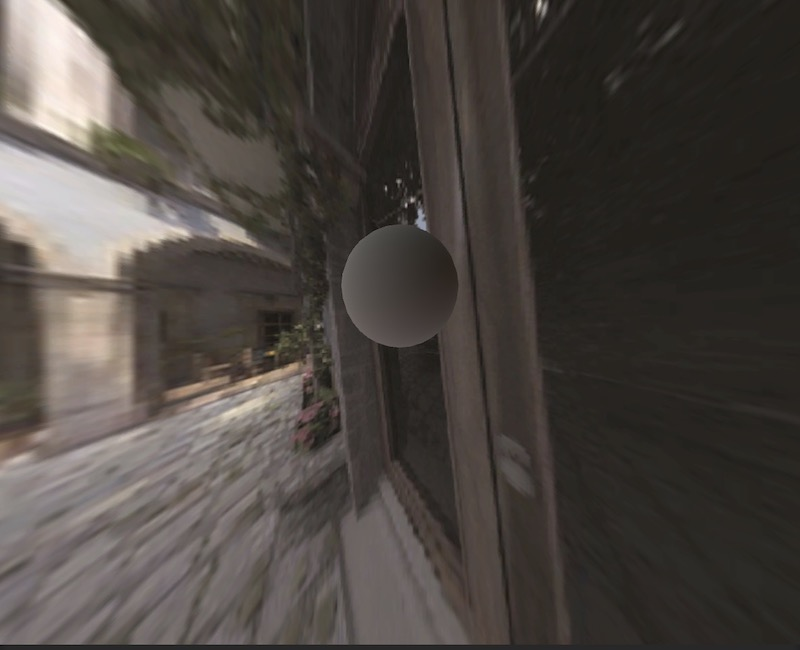
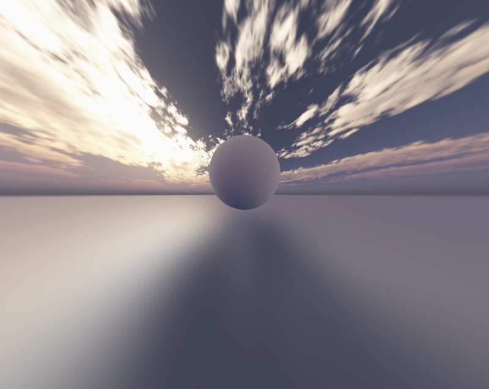
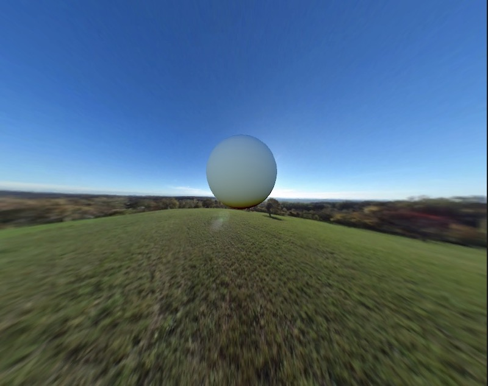
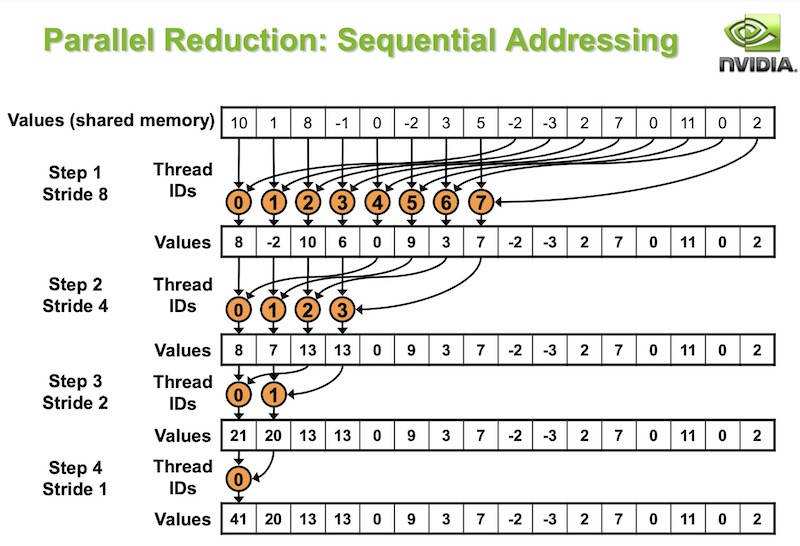
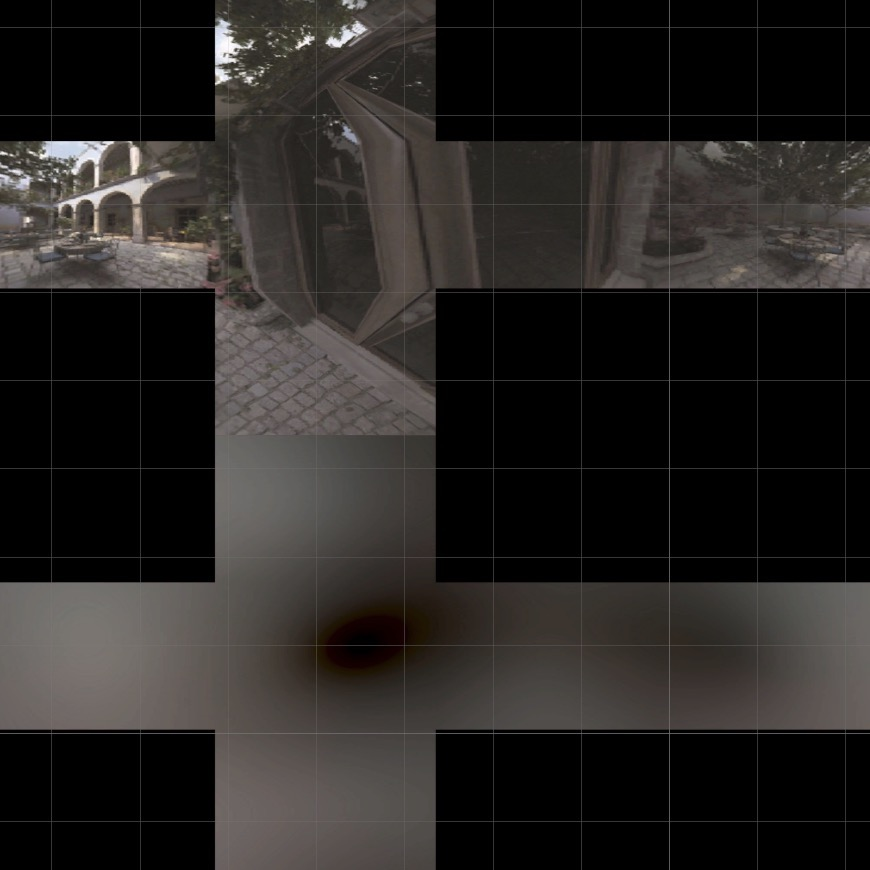
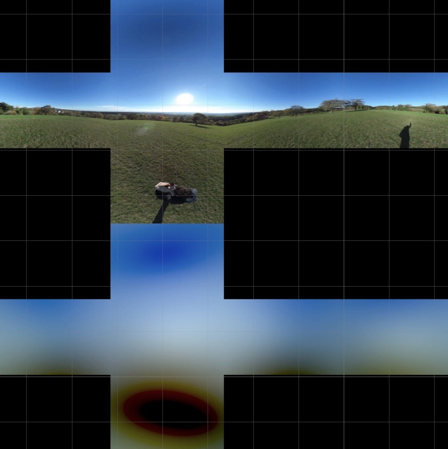

# 球谐光照的GPU烘培与重建实现

最近看了一些球谐光照的实现原理文章。由于实践出真知，故动手做一个小项目来加深理解。此项目将包含以下技术点:

- 利用ComputeShader来进行GPU计算
- 从给定的CubeMap中提取3阶球谐系数(9个float3)
- 利用3阶球谐系数重建低频环境贴图
- CubeMap的映射展开(6 frame layout)

项目包含一个测试场景`(SH9ExampleScene)`，用以可视化球谐系数重建环境光照的效果。 以下是几张最终呈现的效果图:





此文将侧重于技术实现，而对理论部分较少展开(只贴链接)。


# 1. 球谐光照理论简介

我们期望有一个万能函数$f(w)$，只要给定方向w，就能返回对应的方向的入射环境光颜色。将万能函数用球坐标系表示，即$f(\theta,\varphi)$，其中$\theta、\varphi$的定义如下图所示:


可知，$f(\theta,\varphi)$是一个周期函数,其中$\theta$周期为$\pi$，$\varphi$周期为$2\pi$。
  
数学家告诉我们这个函数f可以展开为以下的级数求和形式:

$$

f(\theta,\varphi) = \sum_{i=1}^{n^2}c_iy_i(\theta,\varphi) \tag{1}

$$

其中$c_i$为系数,$y_i(\theta,\varphi)$为一组正交基函数。

正交基函数定义如下:

$$

\int{}y_iy_j = 
\begin{cases}
    0&i \not ={j}\\
    1&i=j
\end{cases}

$$

想要更深入理解以上公式可以参考以下链接(头疼，不看也没事，反正把结论拿来用就是了):


- [函数的正交与傅立叶展开](https://zhuanlan.zhihu.com/p/345370196)
- [广义傅立叶级数](https://mathworld.wolfram.com/GeneralizedFourierSeries.html)
- [球谐函数](https://en.wikipedia.org/wiki/Spherical_harmonics)


这组正交基函数数学家也已经给我们了，参考链接:

https://zh.wikipedia.org/wiki/%E7%90%83%E8%B0%90%E5%87%BD%E6%95%B0


因此，我们只要计算出所有的$c_i$，那岂不是就得到这个万能函数了？

$c_i$怎么算呢? 只需要在等式(1)两侧乘$y_i$，再做积分即可:

$$

\int{}y_if(\theta,\varphi) = c_i 

$$

虽然函数f是未知的，但是我们可以进行大量采样，来近似的模拟f的输入和输出。这就用到了[`蒙特卡罗积分法`](https://zhuanlan.zhihu.com/p/333314002)。


蒙特卡罗积分法可以利用大量的采样，来模拟积分计算。

因此上式可以变为:

$$
c_i = \frac{4\pi}{N}\sum_{j=1}^{N}y_if(\theta_j,\varphi_j) \tag{2}
$$

详尽的理论推导可以参考这个系列: [球谐光照与PRT学习笔记](https://zhuanlan.zhihu.com/p/50208005)

其中$(\theta_j,\varphi_j)$为均匀分布在单位球面上的N个采样点。这个计算过程叫做`投影`(类似几何上求基向量系数的概念)。

针对(1)式，我们给出的$c_i$越多(即n越大)，右侧求和就越逼近真实的函数f。


在本项目中，将利用以上算法，从CubeMap(可以视作一个比较精确的$f(\theta,\varphi)$函数)中，提取3阶球谐系数。然后利用这9个float3球谐系数，来重建环境光漫反射信息。


# 2. 项目实现

首先默认大家已经有ComputeShader的基础知识。如果没有，可以先看下这篇文章:

https://zhuanlan.zhihu.com/p/53785954

特别要理解里面ThreadGroup的概念，以及`SV_GroupID`、`SV_DispatchThreadID`、`SV_GroupIndex`这些语义对应的意思。


## 2.1 球谐系数计算

我们利用公式(2)来计算一个CubeMap的球谐系数。为了得到比较好的近似效果，通常需要大量的采样计算。这个过程如果用CPU来做太慢了。因此这里我们使用Unity中的ComputeShader来实现并行计算。

我们创建`SH9Project.compute`来用作球谐系数计算。

实现会分以下几个部分:

- 球谐基函数定义
- 线程参数定义
- 球面均匀采样点生成
- 采样结果在对应球谐基上的投影计算
- GPGPU求和算法


### 2.1.1 球谐基函数$y_i$定义

我们参考[WIKI](https://zh.wikipedia.org/wiki/%E7%90%83%E8%B0%90%E5%87%BD%E6%95%B0)中给出的前三阶球谐基函数，将其硬编码到`SHCommon.hlsl`中。函数命名格式为

```
GetY{i}0 - 表示l = i, m = 0
GetY(i)p{j} - 表示l = i, m = +i
GetY(i)n{j} - 表示l = i, m = -i
```

给出其中两个实现例子:

```hlsl
//l = 2, m = 1
float GetY2p1(float theta,float phi){
    return 0.5 * sqrt(15 * RCP_PI) * sin(theta) * cos(theta) * cos(phi);
}

//l = 2, m = -1
float GetY2n1(float theta,float phi){
    return 0.5 * sqrt(15 * RCP_PI) * sin(theta) * cos(theta) * sin(phi);
}
```
三阶总共有9个球谐基函数。


### 2.1.2 线程参数

这里我们为每个线程组分配了8x8个线程。假如我们要进行512x512次采样，那么就会有(512x512)/(8x8)=64x64个线程组。

```
#define THREAD_X 8
#define THREAD_Y 8
[numthreads(THREAD_X,THREAD_Y,1)]
void CSMain (uint3 groupID : SV_GroupID,uint3 id : SV_DispatchThreadID,uint groupIndex : SV_GroupIndex){
}
```


### 2.1.3 球面均匀采样

从`SV_DispatchThreadID`中，我们可以拿到均匀分布在`[0,SampleSize)`和`[0,SampleSize)`上的x和y。

SampleSize代表了在$\theta$和$\varphi$各自纬度的采样分布数量。因此总共会有SampleSize*SampleSize个采样点。

利用均匀分布的x和y，我们可以通过以下函数来计算$\theta$和$\varphi$，从而实现球面均匀分布采样

```hlsl
//生成均匀分布的球面采样
static GetThetaPhi(uint x,uint y,out float theta,out float phi){
    theta = acos(1 - x * 2.0 / (SampleSize.x - 1));
    phi = 2 * PI * (y * 1.0 / (SampleSize.y - 1));
}
```

至于为什么使用以上方式可以构建球面均匀分布的采样点，那又是一长篇的数学故事。此处先不细说了。

### 2.1.4 采样投影计算

那么按照公式(2)，我们直觉上可以把采样项的投影求和写作:

```hlsl
float3 color = SampleCube(theta,phi).rgb; //采样CubeMap
uint N = SampleSize.x * SampleSize.y;
float A = 4 * PI / N;
shc[0] += color * GetY00(theta,phi) * A;
....
shc[8] += color * GetY2p2(theta,phi) * A;
```

我们要计算9个系数，因此依次将每个采样点在球谐基$y_i$上的投影计算结果存到对应数组`shc[i]`进行求和。

但以上代码在GPU上是行不通的。 因为GPU是并行计算，`+=`操作相当于N个线程对同一个位置进行读写操作，是会有同步问题的。在Unity中会收到如下警告:
```
race condition writing to shared resource detected
```

因此在GPU上进行并行求和运算，需要用到特殊的算法。

### 2.1.5 GPGPU求和计算

详细的算法可以看nvidia的这篇文章:

https://developer.download.nvidia.com/assets/cuda/files/reduction.pdf

这篇Paper里探讨了好几种求和算法，一个比一个牛逼。本项目仅大致实现了其中一个（能用就行）。如在产品级使用的精益求精者，请自行修改。

用简单的话概括一下就是，假如一个ThreadGroup里有n个线程，我们要对这个n个线程的计算结果求和，可以采样如下方式:

1. 定义一个group shared的数组A，大小为n。
2. 将每个thread的计算结果分别按照自己在group中的index存到A中
3. 等待所有线程完成步骤2，再继续往下
4. 让前一半的线程`(index<n/2)`，从数组的后一半中取值，分别加到前一半对应位置，于是数组的有效大小变为原来的一半。即`n=n/2`。
5. 等待所有线程完成步骤4.
6. 重复4和5，直到n==1。于是数组第一项即是累加结果。

一图胜千言:



参照以上的算法，我们首先定义shcGroup，来用保存ThreadGroup内部每个线程的计算结果:

```hlsl
//SH_DEGREE表示球谐阶，此处为3
groupshared float4 shcGroup[THREAD_X * THREAD_Y * SH_DEGREE * SH_DEGREE];
```

然后实现CalSH函数如下:

```hlsl
//groupIndex为当前线程在线程组中的索引
static void CalSH(float theta,float phi,uint groupIndex){
    float4 color = SampleCube(theta,phi);
    uint N = SampleSize.x * SampleSize.y;
    float A = 4 * PI / N;
    uint groupOffset = groupIndex * shcCount;//此处shcCount是9
    shcGroup[groupOffset + 0] = color * GetY00(theta,phi) * A;
    shcGroup[groupOffset + 1] = color * GetY1n1(theta,phi) * A;
    shcGroup[groupOffset + 2] = color * GetY10(theta,phi) * A;
    shcGroup[groupOffset + 3] = color * GetY1p1(theta,phi) * A;
    shcGroup[groupOffset + 4] = color * GetY2n2(theta,phi) * A;
    shcGroup[groupOffset + 5] = color * GetY2n1(theta,phi) * A;
    shcGroup[groupOffset + 6] = color * GetY20(theta,phi) * A;
    shcGroup[groupOffset + 7] = color * GetY2p1(theta,phi) * A;
    shcGroup[groupOffset + 8] = color * GetY2p2(theta,phi) * A;
}
```
ThreadGroup中的每个线程，都将自己的计算结果，存到了各自在shcGroup数组中的偏移位置。

求和算法如下:

```hlsl
CalSH(theta,phi,groupIndex);
GroupMemoryBarrierWithGroupSync();
uint threadCount = THREAD_X * THREAD_Y;
for(uint k = (threadCount >> 1); k > 0; k >>= 1){
    if(groupIndex < k)
    {
        uint shIndex = groupIndex * shcCount; 
        uint shIndex2 = (groupIndex + k) * shcCount;
        for(uint offset = 0; offset < shcCount; offset ++){
            shcGroup[shIndex + offset] += shcGroup[shIndex2 + offset];
        }
    }
    GroupMemoryBarrierWithGroupSync();
}
```
`GroupMemoryBarrierWithGroupSync`这个函数是让线程在此处等待，直到该线程组内所有线程都运行到此处，再统一往下运行。

在以上代码运行完毕之后，`shcGroup[0] ~ shcGroup[8]`中便依次保存了该线程组内所有采样点在球谐基$y_0$ ~ $y_8$的投影求和结果。

接下来我们还得针对所有线程组的结果再次进行求和，才能得到最终的球谐系数。由于线程组数量不多，我们直接将结果回传给CPU端，让CPU来进行最终求和。

因此首先定义ComputeBuffer:

```hlsl
RWStructuredBuffer<float4> shcBuffer;
```

当每个线程组的计算结果出来之后，我们利用第一个线程,将其写到shcBuffer中:

```hlsl
if(groupIndex == 0){
  uint groupCountX = SampleSize.x / THREAD_X;
  uint index = (groupID.y * groupCountX + groupID.x) * shcCount;
  for(uint i = 0; i < shcCount; i ++){
      float4 c = shcGroup[i];
      shcBuffer[index + i] = c;
  }
}
```
其中index为线程组的索引。

在c#端，我们通过`AsyncGPUReadback.Request(shcBuffer,callback)`来异步等待GPU的计算结果，拿到shcBuffer。大致如下:

```csharp
const int SHC_COUNT = 9;

var shcBuffer = new ComputeBuffer(GROUP_X * GROUP_Y * SHC_COUNT,16);
computeShader.SetBuffer(0,"shcBuffer",shcBuffer);
///...dispatch
AsyncGPUReadback.Request(shcBuffer,(req)=>{
   var groupShc = req.GetData<Vector4>();
   var count = groupShc.Length / SHC_COUNT;
   var shc = new Vector4[SHC_COUNT];
   for(var i = 0; i < count; i ++){
       for(var offset = 0; offset < SHC_COUNT; offset ++){
           shc[offset] += groupShc[i * SHC_COUNT + offset];
       }
   }
   shcBuffer.Release();
});

```

`groupShc`即`shcBuffer`，保存了每个线程组的求和结果。我们再将其累加，最终得到了一个`Vector4[9]`类型的数组。里面记录了RGB三个通道的各自9个球谐系数。注意，我们这里没用到`Vector4.w`这个分量，浪费了，其实RGB三通道总共27个float，是可以压缩到7个`Vector4`中的，但是此项目为了可读性而不这么做。

为了测试方便，项目中提供了将SH9参数保存为`SHCAssetObject`资源(一个ScriptableObject)的功能。
选中一个CubeMap，`右键->SHLearn->CreateSH9AssetFromCubeMap`即可从对应的CubeMap中计算三阶球谐系数，并保存为SHCAssetObject。

## 2.2 重建低频环境光信息

有了2.1中计算出的球谐系数后，我们在Runtime下，只要使用公式(1)，即可重建低频光照信息。

为了检测2.1中计算出的球谐系数是否正确，在这个项目中提供了两种方式去生成可视化效果。

- 其一为编写一个ComputeShader，直接利用三阶球谐系数去重建一个CubeMap贴图，来与原图做对比。
- 其二为替物体编写一个普通的Shader，在场景中使用球谐系数进行环境光着色。


### 2.2.1 利用球谐系数重建CubeMap

对应的Shader和脚本分别为`SH9ReconstructToTexture.compute`和`SH9Reconstruct.cs`。

大致的思路是在定义线程参数的时候，令x,y代表Cube一个面的分辨率,令z = 6，代表6个面。这样我们在ComputeShader里即可利用DispathThreadID构建出Cube每个面上的像素点坐标。 然后利用公式1，即可求得该像素的值。

在项目中可以选中一个SHCAssetObject资源，`右键->SHLearn->ReconstructTextureFromSH9`来生成重建后的Cube6面展开贴图。以下是其中两张的对比图:





说实话我不是很确信重建后出现这么明显的"黑洞"，是否正常？还是我的实现上有什么问题呢？虽然我勉强可以找出理由，比如图2的"黑洞"区域正好是下方有一条狗。


### 2.2.2 利用球谐系数为物体进行环境光着色

着色代码也很简单，同样是利用公式(1):

```hlsl
half4 SH9(float3 dir){
    float3 d = float3(dir.x,dir.z,dir.y);
    float4 color = 
    _shc[0] * GetY00(d) + 
    _shc[1] * GetY1n1(d) + 
    _shc[2] * GetY10(d) + 
    _shc[3] * GetY1p1(d) + 
    _shc[4] * GetY2n2(d) + 
    _shc[5] * GetY2n1(d) + 
    _shc[6] * GetY20(d) + 
    _shc[7] * GetY2p1(d) + 
    _shc[8] * GetY2p2(d);
    return color;
}
```
这里有两个注意点:

- dir是单位方向向量。用直角坐标系表示。因此我们这里用到的球谐基均是定义在xyz直角坐标系上的，要与2.1中定义在球面坐标系上的球谐基做好区分。
- 在计算球谐基的时候，我们将y和z对换了一下。这是因为硬编码的时候参考wiki中的实现，其坐标系和Unity中的坐标系y-z是互换的。

然后在片段函数中，利用世界法线取色就可以了:

```hlsl
fixed4 frag (v2f i) : SV_Target
{
    float3 normalWS = i.normalWS;
    return SH9(normalWS);
}
```

在项目中，可以利用`SHLightLearn/Example/SH9ExampleScene`进行效果测试.

- 选中Example对象
- 替换Inspector中的skybox对象
- 点击Update按钮即可查看效果


